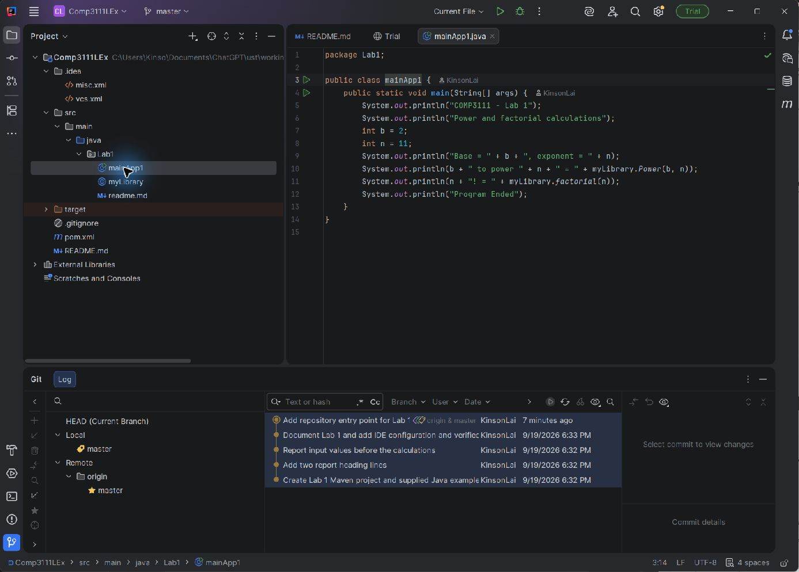

# COMP3111 Lab 1

This Maven project contains the two Java classes from the Lab 1 appendix:

- `myLibrary.java` implements the recursive power and factorial functions.
- `mainApp1.java` prints report headings and evaluates 2 to the power of 11 and 11 factorial.

The sample functions assume positive arguments, as in the supplied exercise.
Expected calculation results are `2048` and `39916800`.

## Run

Open the root `pom.xml` as a Maven project in IntelliJ IDEA, select JDK 21,
and run `Lab1.mainApp1`.

## Git history

The repository records separate changes for the initial project, two report
headings, the input-value report, and project documentation/build output.

## Required IntelliJ screenshot

Pending: add a genuine screenshot showing the expanded `.idea` and `src`
folders, the `myLibrary.java` or `mainApp1.java` editor, and Git Log with at
least four commits. Place the image at the repository root as
`lab1-intellij.png` and embed it here using:

```markdown

```

This screenshot requirement has not yet been completed.
